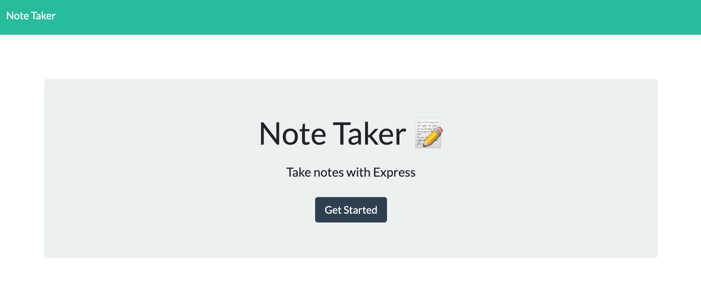

# Note Taker

## Description

This application can be used to write, save, and delete notes using an express backend and save and retrieve note data from a JSON file.

## User Story

AS A student
I want to be able to write, save, edit, and delete notes
SO THAT I can organize my thoughts and keep track of tasks I need to complete

You are able to view deployed application [here](https://still-tor-76275.herokuapp.com/).

